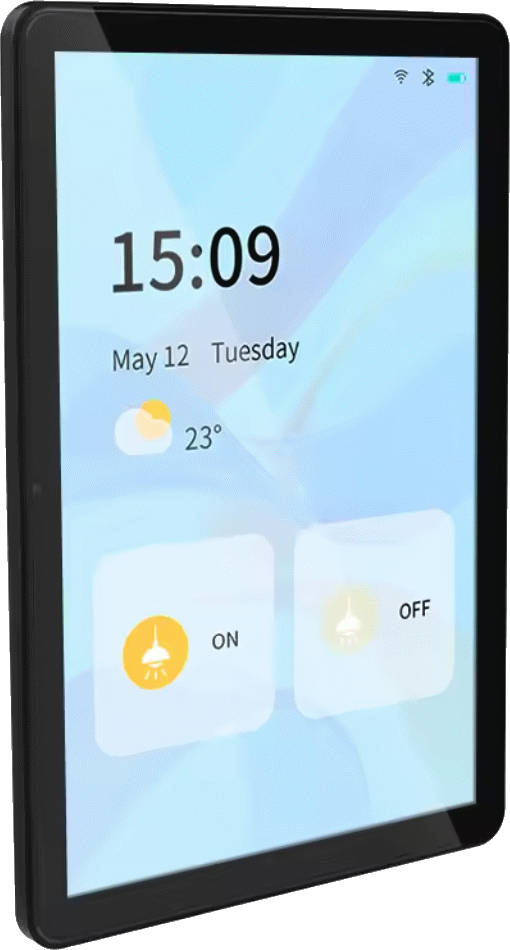
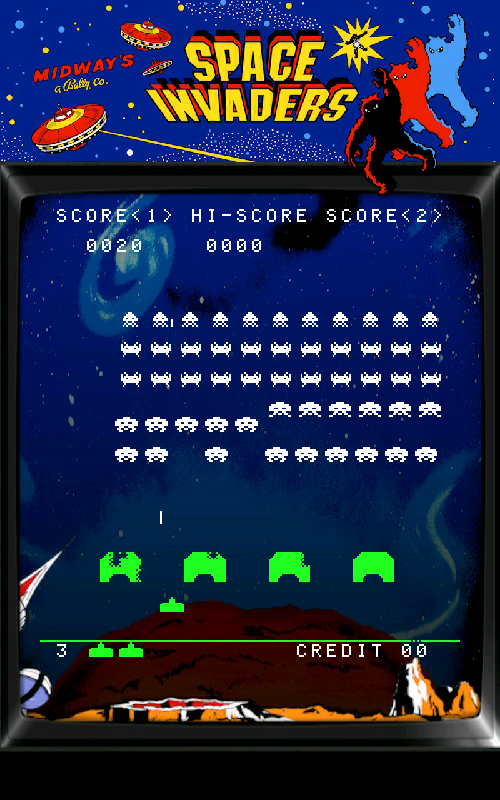
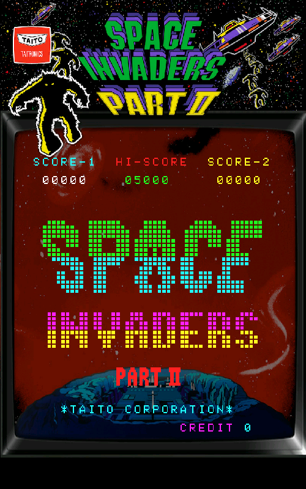
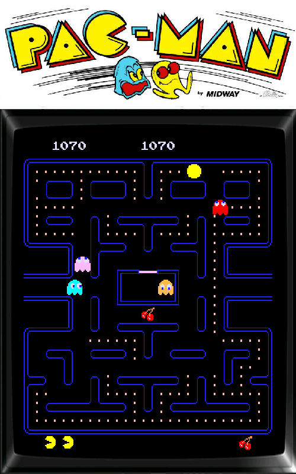
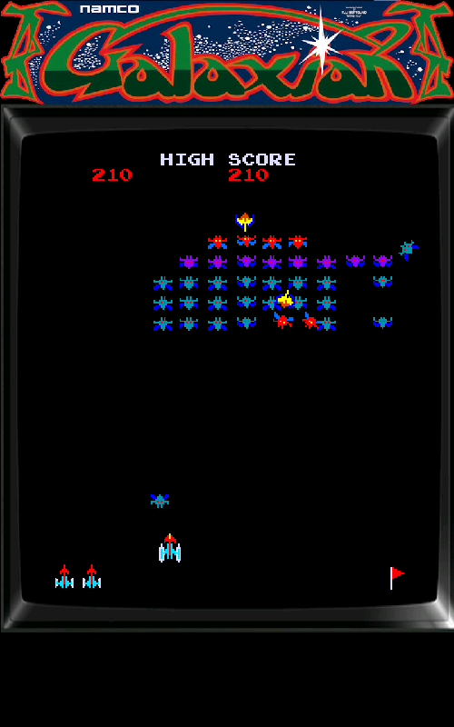
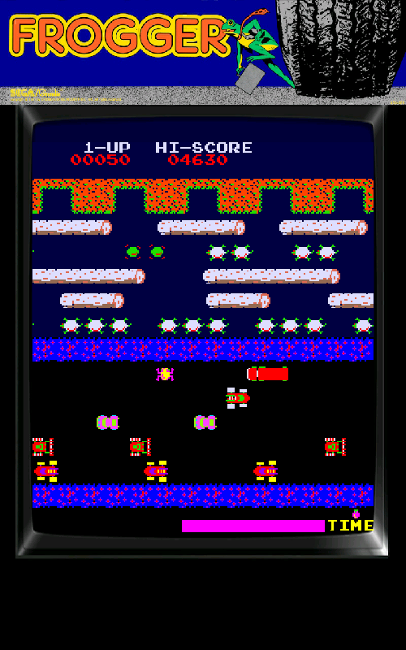
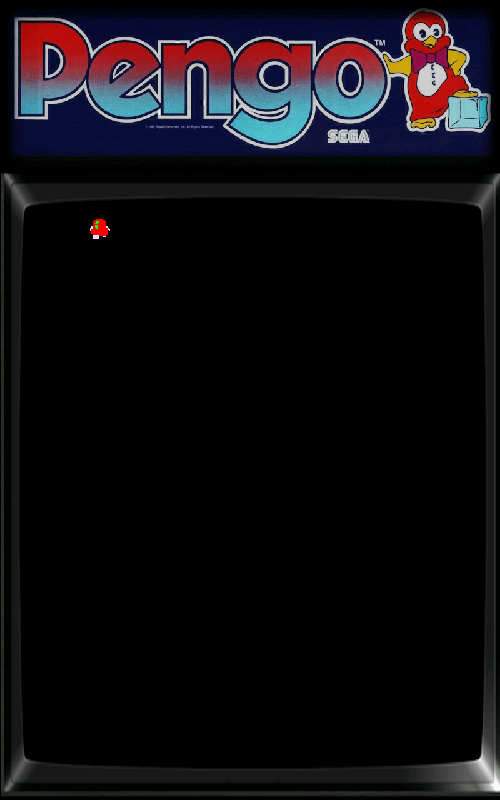

# 🕹️ EspArcade  
Emulateur logiciel en C / C++, basé sur le principe de M.A.M.E.  
L'objectif est de réaliser un émulateur software pour un ESP32-P4. 

Pour le moment, l'audio n'est pas du tout pris en compte. C'est une fonctionalité que je ne connais pas du tout, je n'ai jamais développé sur cette fonctionalité. Cela viendra plus tard quand j'aurai quelques jeux d'opérationnels.  

Ce projet existe en version PC Windows, nommé [RayLibArcade](https://github.com/BorisFR/RayLibArcade), pour pouvoir tester mon code sans avoir l'ESP32-P4 sous la main.  

> <ins>Auteur :</ins> Boris  
<ins>Démarrage :</ins> Août 2025  

| ** NON JOUABLE ACTUELLEMENT ** |
| :--: | 

Il n'y a aucun control implémenté pour le joueur 😊  

## ESP32-P4

|       |      |
| :---: | :--- |  
|  | Mon objectif est d'exécuter mon émulateur sur ce device. La mémoire flash est de 16 MB. Il a 32 MB en PSRAM et 500 KB de RAM. L'écran IPS mesure 10,1 pouces, il est tactile et a une résolution de 800 x 1280 en 24 bit (3 octets). Je l'utilise en 16 bit (2 octets) afin de limiter le travail nécessaire par le processeur et la taille mémoire utilisé pour le graphisme. <br> J'utiliserais peut-être l'ESP32-C6-mini qui est intégré pour sa gestion du bluetooth afin de pouvoir utiliser une manette bluetooth.  |

## Jeux  

       


## Environnement de développement  

Le code est réalisé sous Visual Studio Code avec le framework espressif ESP-IDF, en C & C++S.  
Pour la petite histoire : j'étais un utilisateur de platformio mais à cause de la mésentante des deux sociétés, les derniers modèles de chez espressif ne sont plus utilisable dans platformio. Il y a bien une tentative de la communauté de faire l'équivalent de platformio pour continuee le support de espressif, notament en utilisant le framework arduino, mais j'ai échoué à le mettre en place. Pour moi c'était le signal de basculer le développement en pur espressif ESP-IDF.    

## Performances  

Mesures effectuées sans limite activée, chaque jeu a une résolution qui est doublée en largeur et hauteur.  

| 🕹️ Jeu | Nom du<br>dossier | Gameplay | Audio | FPS | Screen dirty<br>Implemented | C.P.U. |
| :--- | :--- | :--- | :--- | ---: | :--- | :--- |
| Space Invaders | invaders | ✅ | ❌ | 350 | 🟢 | i8080 |
| Space Invaders Part II | invadpt2 | ✅ | ❌ | 350 | 🟢 | i8080 |
| Pacman | pacman | ✅ | ❌ | 65 | 🟡 | z80 |
| Frogger | frogger | ❌ | ❌ | 16 | 🟡 | 2 x z80 |
| Galaxian | galaxian | ✅ | ❌ | 40 | 🟡 | z80 |

# Structure des dossiers de la carte SD

In _background: all the background image for each game, plus 'themenu.jpg'
In _menu: all the marquee for the menu
One folder for each game, contains each roms for the game. (no zip file)
Details for each game is available here: [Games List](https://borisfr.github.io/EspArcade/)

```
├── _background
│   ├── game.jpg
│   ├── othergame.jpg
│   ├── ...
│   ├── themenu.jpg
│   └── ...
├── _menu
│   ├── game.jpg
│   ├── othergame.jpg
│   └── ...
├── game
│   ├── rom1
│   ├── rom2
│   └── ...
├── othergame
│   ├── rom1
│   ├── rom2
│   ├── rom3
│   └── ...
├── ...
```
