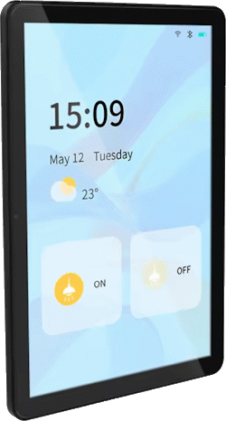
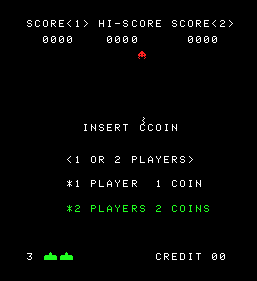
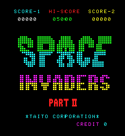
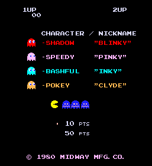
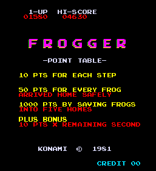

# 🕹️ EspArcade  
Emulateur logiciel en C / C++, basé sur le principe de M.A.M.E.  
L'objectif est de réaliser un émulateur software pour un ESP32-P4. 

Pour le moment, l'audio n'est pas du tout pris en compte. C'est une fonctionalité que je ne connais pas du tout, je n'ai jamais développé sur cette fonctionalité. Cela viendra plus tard quand j'aurai quelques jeux d'opérationnels.  

Ce projet existe en version PC Windows, nommé RayLibArcade pour pouvoir tester mon code sans avoir l'Esp32P4 sous la main.  

> <ins>Auteur :</ins> Boris  
<ins>Démarrage :</ins> Août 2025  

| ** NON JOUABLE ACTUELLEMENT ** |  |
| :--: | --- |  

Il n'y a aucun control disponible pour le joueur 😊  

## ESP32-P4

|       |      |
| :---: | :--- |  
|  | Mon objectif est d'exécuter mon émulateur sur ce device. La mémoire flash est de 16 MB. Il a 32 MB en PSRAM et 500 KB de RAM. L'écran IPS mesure 10,1 pouces, il est tactile et a une résolution de 800 x 1280 en 24 bit (3 octets). Je l'utilise en 16 bit (2 octets) afin de limiter le travail nécessaire par le processeur et la taille mémoire utilisé pour le graphisme.   J'utiliserais peut-être l'ESP32-C6-mini qui est intégré pour sa gestion du bluetooth afin de pouvoir utiliser une manette bluetooth.  |

## Jeux  

   
